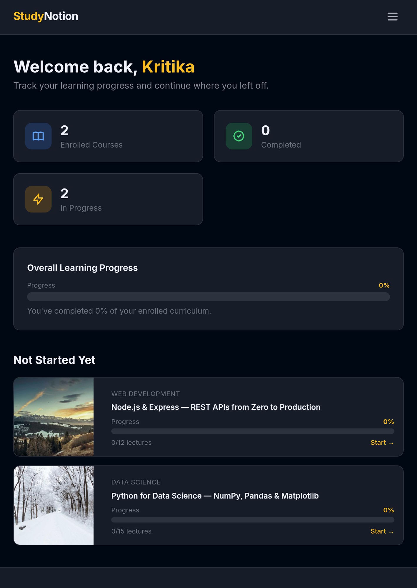
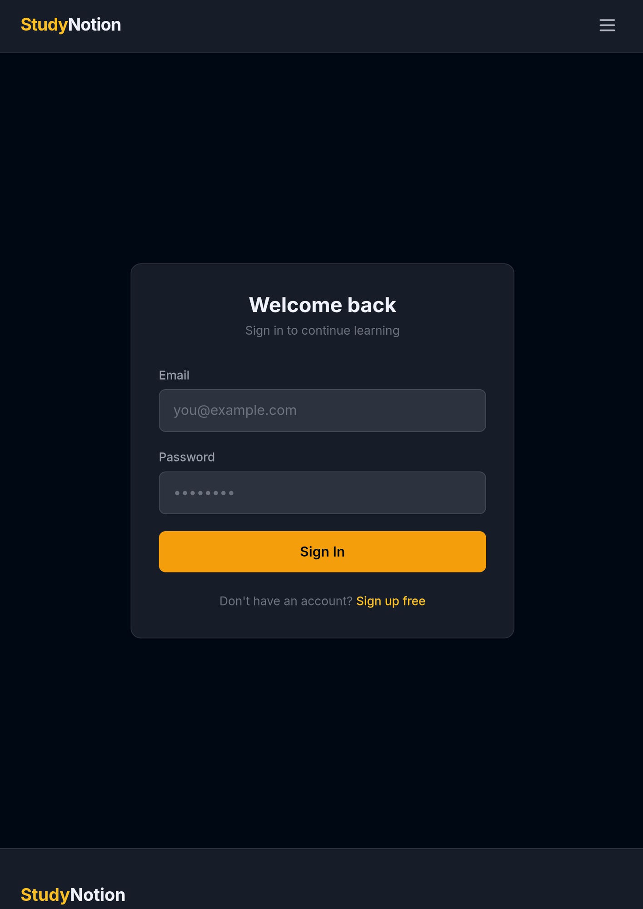

# StudyNotion

An EdTech platform where students can browse courses, enroll, and track their progress. Built end-to-end with React, Redux, Node.js, Express, and MongoDB.

**Live:** [studynotion.kritika.online](https://studynotion.kritika.online)

**Stack:** React 18 · Redux Toolkit · Node.js · Express · MongoDB · Tailwind CSS

---

## Screenshots


*Homepage with featured courses and hero section*


*Course detail page with collapsible curriculum*


*Student dashboard showing progress across enrolled courses*


*Login page*

---

## What it does

- Course catalog — filter by category, level, or search. Filters sync to the URL so you can share a link
- Course detail page with collapsible curriculum sections and lecture durations
- One-click enrollment with a sticky sidebar
- Student dashboard showing per-course progress bars, grouped by in-progress / not started / completed
- JWT auth — register, log in, protected routes redirect back after login
- 11 REST endpoints across auth, courses, enrollments, and progress tracking

---

## Running locally

You'll need Node.js ≥ 18 and MongoDB (local or Atlas).

```bash
# Install everything
npm run install:all

# Set up environment
cp server/.env.example server/.env
# Fill in MONGO_URI and JWT_SECRET

# Seed sample courses
npm run seed

# Start both servers
npm run dev
```

React on `localhost:3000`, API on `localhost:5000`.

Generate a JWT secret:
```bash
node -e "console.log(require('crypto').randomBytes(64).toString('hex'))"
```

Other scripts: `npm run server` (API only), `npm run client` (React only).

---

## API

Base URL: `/api` — protected routes need `Authorization: Bearer <token>`

```
POST   /auth/register              { name, email, password }
POST   /auth/login                 { email, password }
GET    /auth/me                    🔒

GET    /courses                    ?category, level, search, page, limit
GET    /courses/featured
GET    /courses/:id

POST   /enrollments                🔒  { courseId }
GET    /enrollments/my             🔒

GET    /progress/dashboard/stats   🔒
GET    /progress/:courseId         🔒
PUT    /progress/:courseId/lectures/:lectureId  🔒
```

All requests pre-filled in `api.http` — open with VS Code REST Client.

---

## Project structure

```
studynotion/
├── server/
│   ├── config/          db connection, constants
│   ├── controllers/     auth, courses, enrollment, progress
│   ├── middleware/       JWT auth, error handler, field validation
│   ├── models/          User, Course (nested sections/lectures), Enrollment, Progress
│   ├── routes/
│   └── utils/seedData.js
└── client/src/
    ├── components/      Navbar, CourseCard, CourseFilter, ProgressBar, etc.
    ├── pages/           Home, Courses, CourseDetail, Dashboard, Login, Register
    ├── redux/           store + 4 slices (auth, courses, enrollments, progress)
    └── services/api.js  Axios with JWT interceptor
```

---

## A few things worth knowing

**Redux over Context** — switched after noticing Context was re-rendering the Navbar on every progress update. RTK slices isolate state by domain and `createAsyncThunk` handles loading/error lifecycle without extra code.

**Lazy loading** — each page is a separate `React.lazy` import in `App.jsx`, so the Dashboard and CourseDetail are never downloaded until the user navigates there.

**Enrollment duplicates** — the Enrollment model has a compound unique index on `{ student, course }`. A second enroll attempt hits a Mongo `11000` error which the error handler converts to a 409, no extra query needed.

**Progress percentage** — `Course` has a `totalLectures` virtual that sums across sections. `Progress.getPercentage()` divides completed lectures by that. Hits 100% → enrollment is automatically marked complete.

**Rate limiting** — auth routes capped at 20 req/15 min vs 100 globally. Deployed on Render which sits behind a reverse proxy, so `trust proxy: 1` is set to let `express-rate-limit` read the real client IP correctly.

---

## Deployment

- Frontend on **Vercel** → [studynotion.kritika.online](https://studynotion.kritika.online)
- Backend on **Render** (free tier — first request after idle may take ~30s)
- Database on **MongoDB Atlas** (M0 free cluster)
